# PrimeAgencyDemo

A demo project for PrimeAgency showcasing a modern, clean web experience and core agency workflows.

## Overview

`PrimeAgencyDemo` is intended as a lightweight foundation that can be used for:

- Demonstrating landing-page structure for an agency website
- Prototyping features before integrating into production
- Testing UI and content ideas quickly
- Sharing a minimal, easy-to-run codebase with collaborators

## Tech Stack

Update this section once the actual stack is selected.

- Frontend: TBD
- Backend: TBD
- Database: TBD
- Deployment: TBD

## Getting Started

### Prerequisites

Install the tools required by your stack (for example: `Node.js`, `npm`, `Python`, `Docker`, etc.).

### Installation

1. Clone the repository:

```bash
git clone https://github.com/hadi-daouk/PrimeAgencyDemo.git
cd PrimeAgencyDemo
```

2. Install dependencies (replace with your actual command):

```bash
# Example
npm install
```

### Run Locally

Use your project start command:

```bash
# Example
npm run dev
```

## Project Structure

Add your real structure once files are in place.

```text
PrimeAgencyDemo/
  ├─ src/
  ├─ public/
  ├─ README.md
  └─ ...
```

## Environment Variables

Create a local environment file if needed:

```bash
# Example
cp .env.example .env
```

Document required variables in `.env.example`.

## Screenshots

These screenshots were captured from the PrimeAgency pages and user flows.

### Public Pages

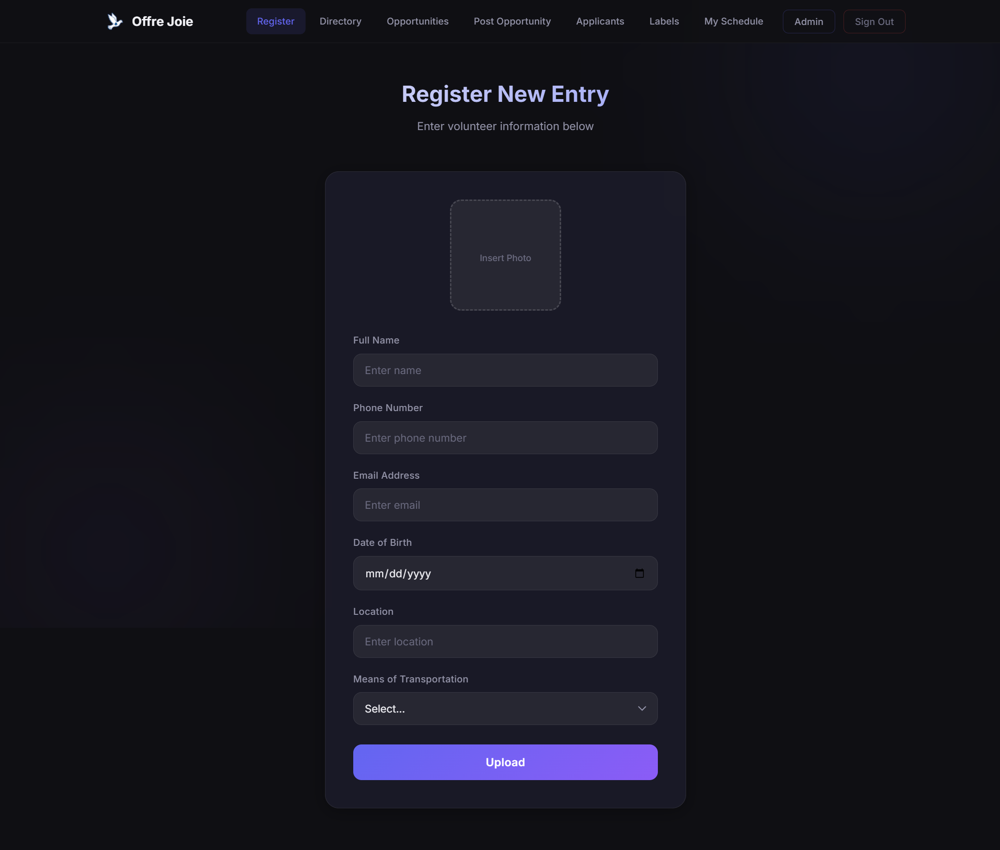
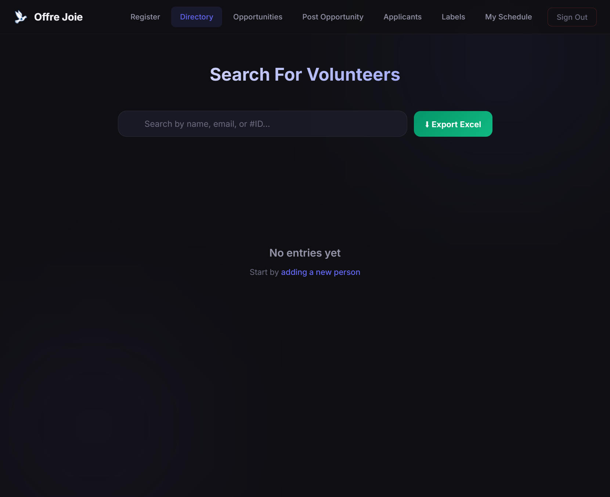
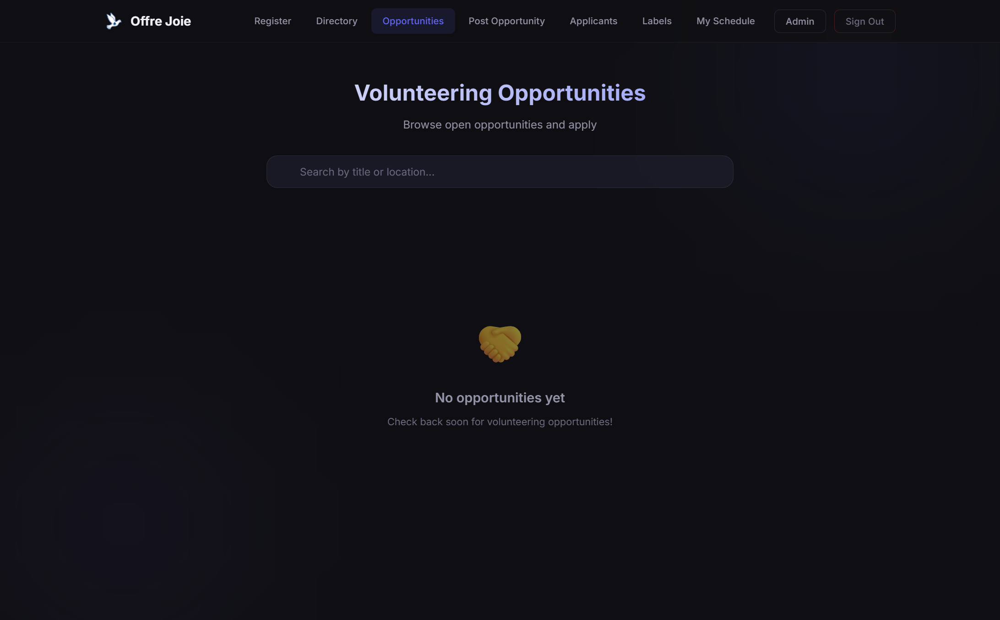
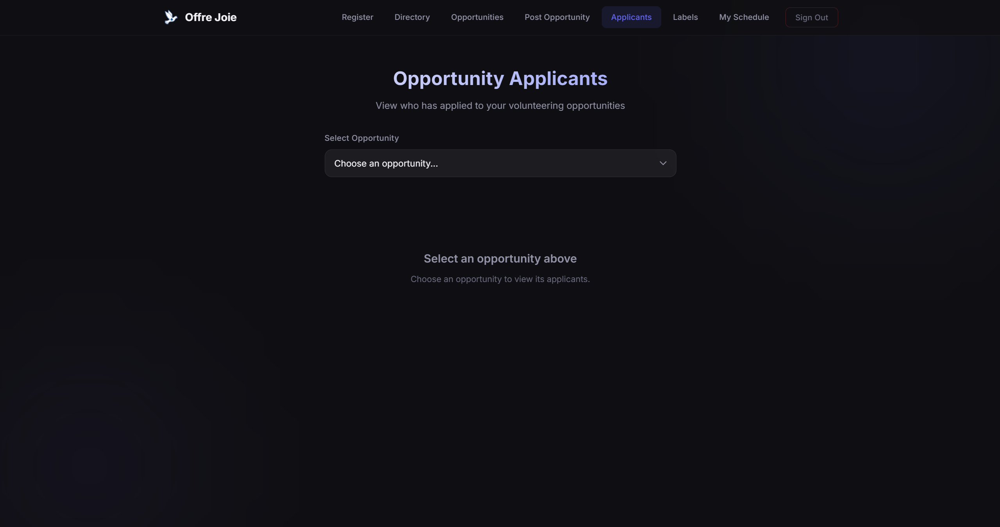
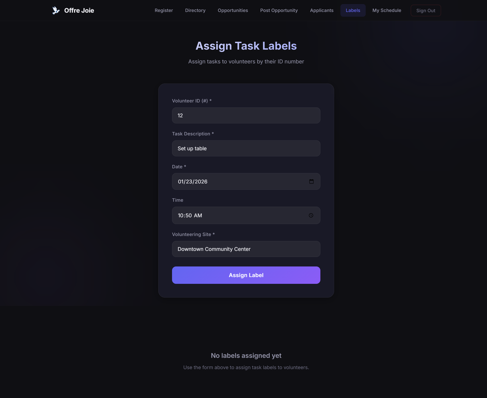
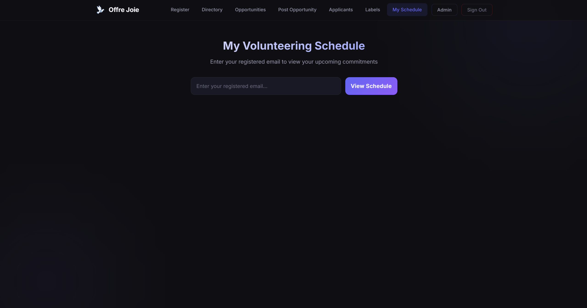
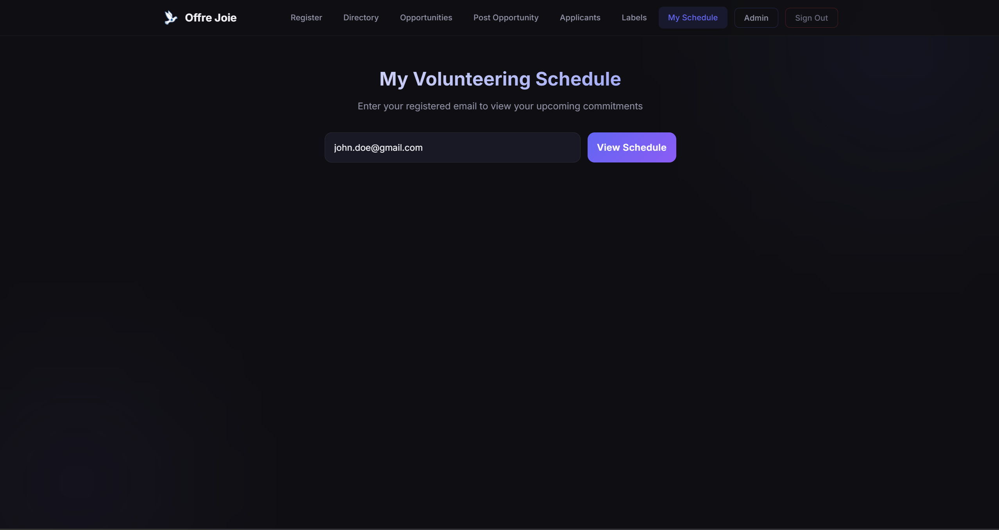
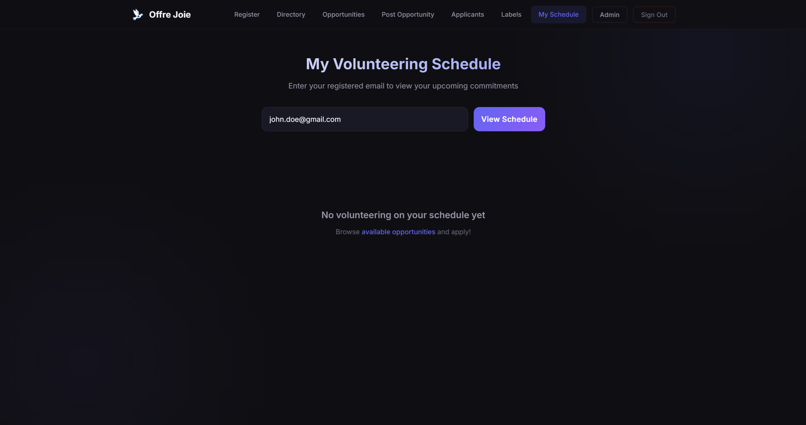

### Registered User Views

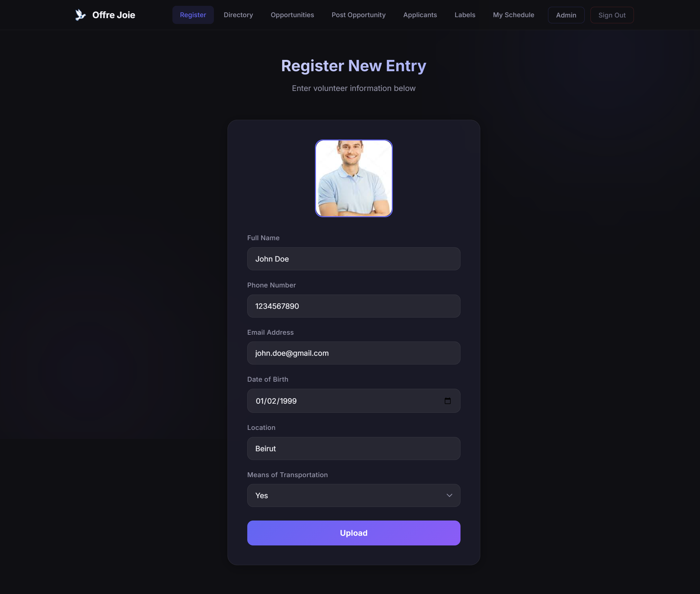
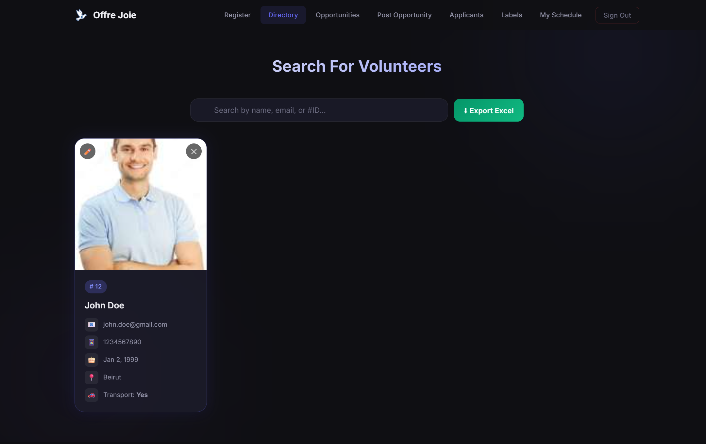
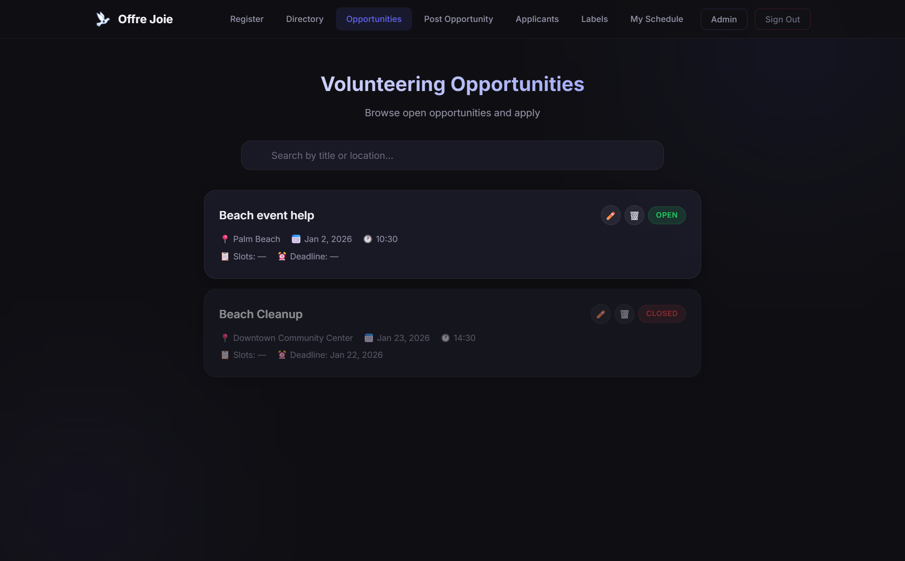
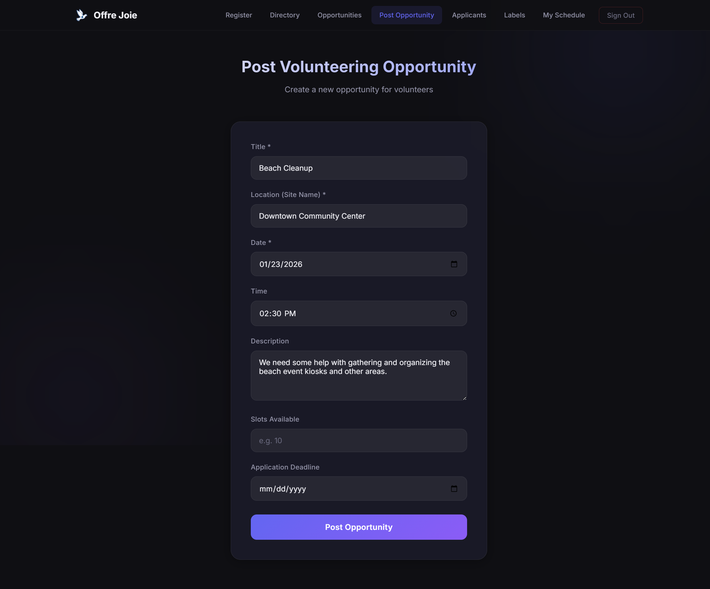
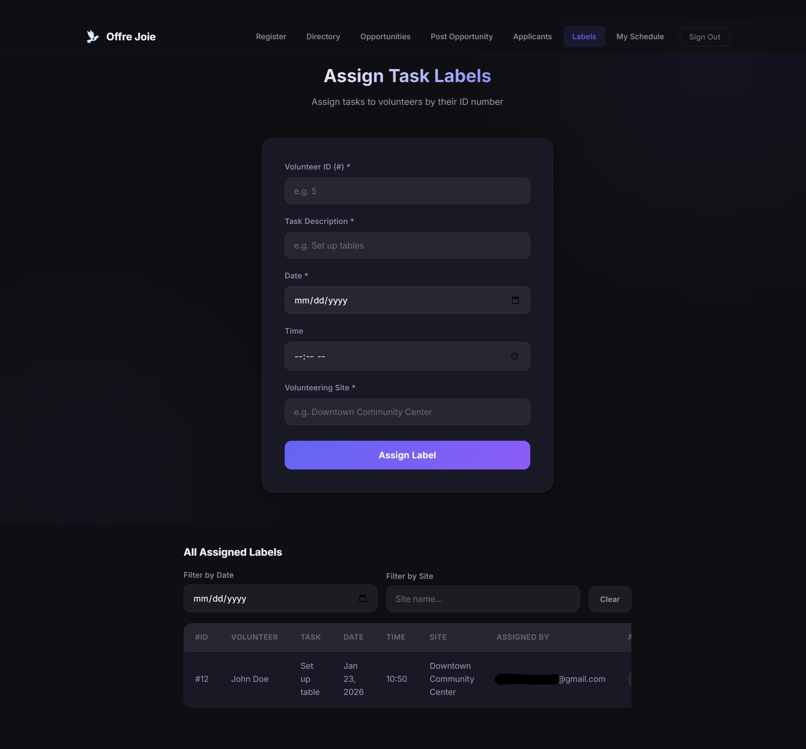
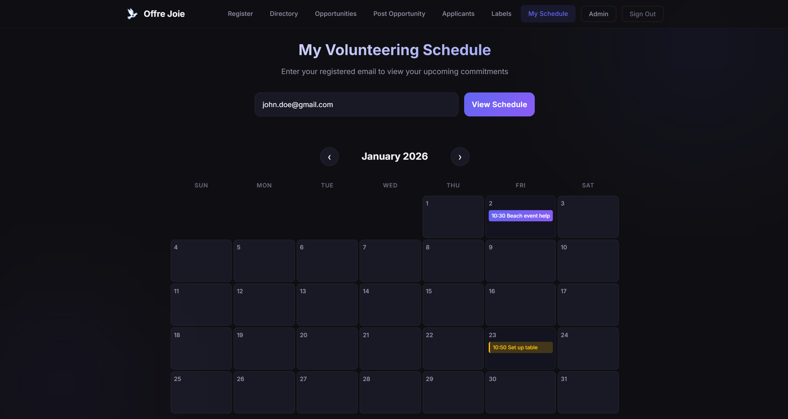

## Roadmap

- [ ] Initialize application scaffold
- [ ] Build homepage and core sections
- [ ] Add responsive design and accessibility checks
- [ ] Add deployment configuration
- [ ] Add tests and CI pipeline

## Contributing

Contributions are welcome.

1. Fork the repository
2. Create a feature branch
3. Commit your changes
4. Open a pull request

## License

Choose and add a license (for example: MIT) in a `LICENSE` file.
